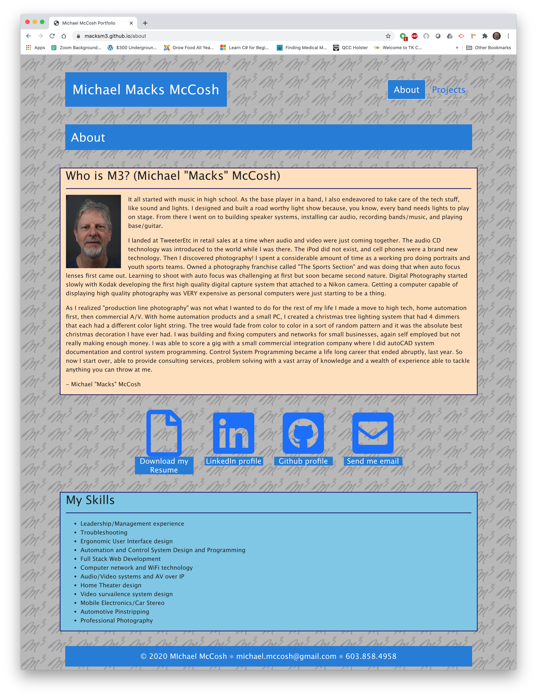
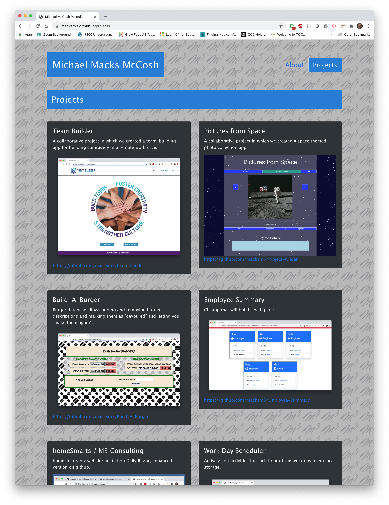

# react-portfolio
hw 20 react portfolio
## Description
A new version of personal portfolio site built with React. The intention is to exactly duplicate the html version previously submitted.

Github repo: https://github.com/macksm3/react-portfolio

Deployed app: https://macksm3.github.io/react-portfolio/

## Table of Contents 

* [Installation](#installation)
* [Usage](#usage)
* [Contributers](#contributers)
* [License](#license)

## Installation
This app resides on the github server and is accessed with a web browser.

## Usage
This site is useful to learn about me, see my programming skills, download my resume or contact me. 

## License
MIT License

## Badges

